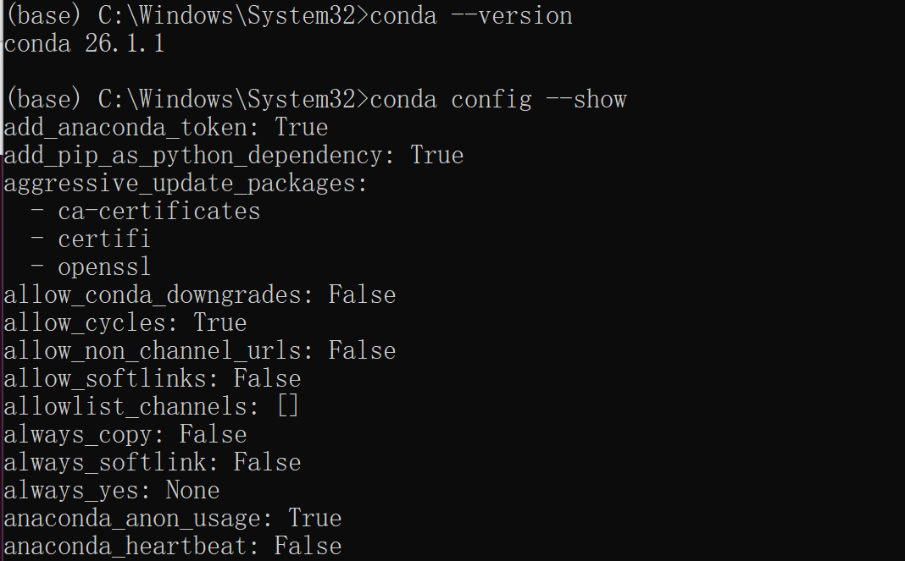
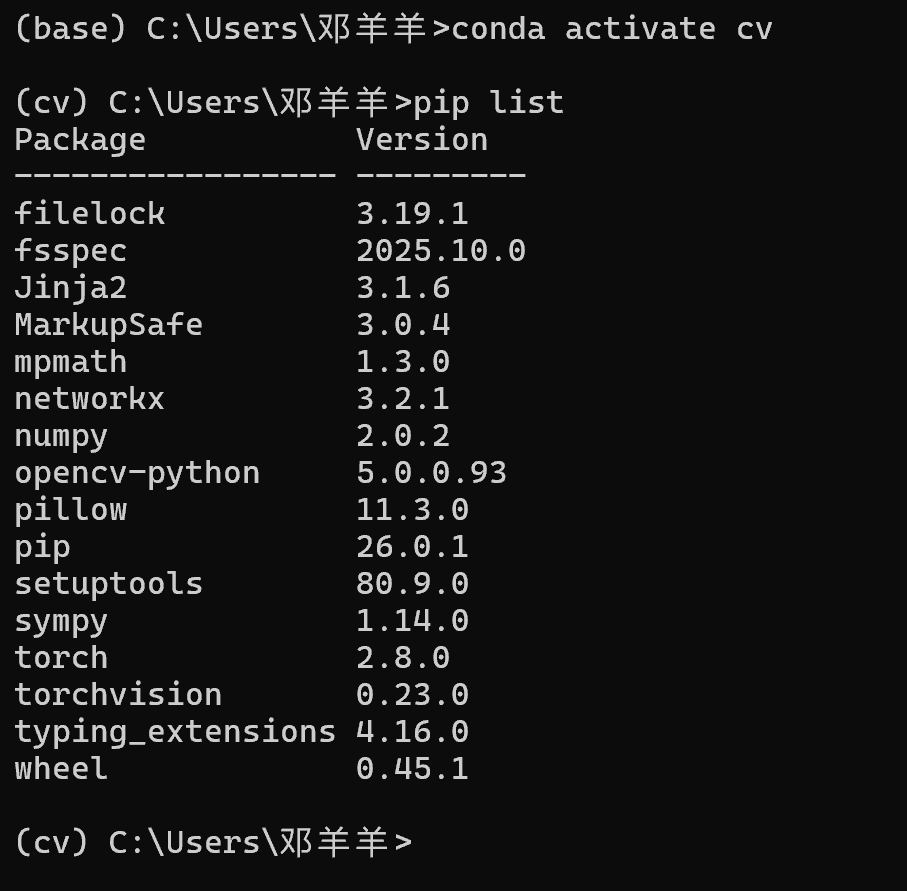
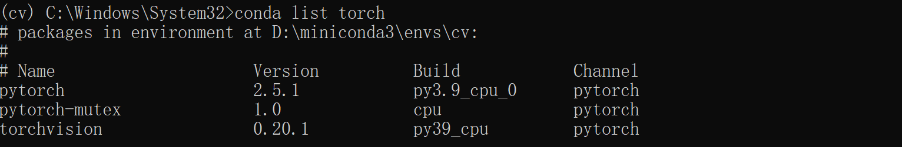
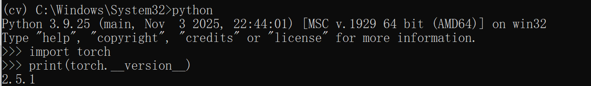

# 实验一：计算机视觉开发环境搭建
## 一、实验目的
掌握Anaconda工具的基础使用方法，完成Python虚拟环境的构建；熟悉OpenCV计算机视觉库与CPU版PyTorch深度学习框架的部署流程，搭建可供后续计算机视觉实验使用的开发运行环境。

## 二、实验内容
### 1、Anaconda基础校验
Anaconda软件预先完成安装，在终端执行命令校验conda版本与基础配置参数，确认软件运行正常。

执行输出查看conda各项配置项，确认镜像、更新策略等参数无误。

### 2、虚拟环境创建与OpenCV库部署
1. 新建独立虚拟环境，指定Python解释器版本
2. 激活`cv`虚拟环境， activate cv 进入创建的虚拟环境， pip install opencv-python 安装OpenCV。
3. 查看环境已安装包，确认OpenCV安装结果

> 说明：本机使用Intel核显，无NVIDIA独立显卡，不支持CUDA硬件加速，不需要安装CUDA与cuDNN。

### 3、PyTorch（CPU版本）框架安装
至PyTorch官网选择对应版本进行下载，使用 conda list pytorch 语句可以看到已经成功安装，信息如下：

### 5、PyTorch环境有效性验证
进入Python交互环境执行验证代码：

> 输出版本号与`False`，CPU版本PyTorch验证通过。

## 三、实验总结
1. 本实验完成了前置环境配置，为后续实验提供软件基础。
2. 掌握Anaconda虚拟环境创建、激活和包管理等操作。
3. 在集成显卡设备上完成OpenCV、CPU版PyTorch部署，为后续实验奠定基础。
